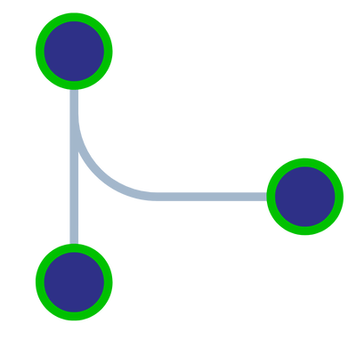

# Ramas en Git

## ¿Qúe es una rama?

Es una versión de los directorios y archivos del repositorio

Cuando creamos una nueva rama, se crea una copia de los archivos actuales

Al formar parte de un equipo que trabaja sobre el mismo código , se usan las ramas para paralelizar el trabajo.

Una vez terminado el trabajo se integra a la rama principal

## Estados

Al usar Git los archivos pueden encontrarse en los siguientes estados:
* **modified:** Archivo modificado, se encuentra en el directorio de trabajo, marcado como modificado
* **staged:** Archivo que ha sido modificado y marcado para ser confirmado
* **commited:** El archivo está guardado en el repositorio local