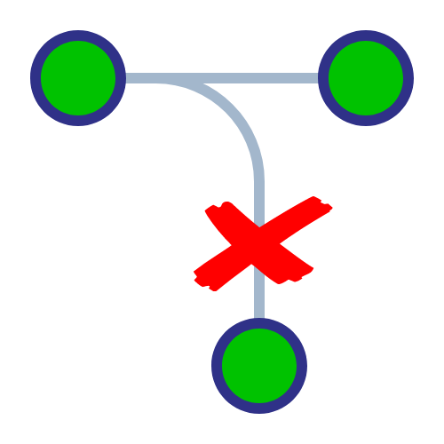

# Eliminando ramas


Una buena práctica luego de realizar una funcionalidad en una rama específica y fusionarla con una rama de colaboración por ejemplo la rama main, es borrar la rama

Habrá que añadir el parámetro **--delete** o su forma corta **-d** al comando **git branch**


```
git branch --delete <nombreRama>
```

El siguiente comando permite eliminar ramas del repositorio que no se usan

```
git remote prune origin
```
