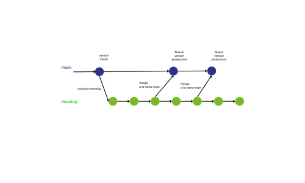

# Flujo de trabajo

## Git Flow

Es la estrategia de trabajo más famosa, Vincent Diesen fue quien la ideó y presentó en el 2010

Está basada en ramas principales, las mismas que deben ser creadas al iniciar el repositorio

## Ramas principales

* **main:** Es la rama que contiene el código que se encuentra en el ambiente productivo

* **develop:** Contiene el código de pre-producción con las nuevas funcionalidades que tiene que ser aprobadas, certificadas

Cuando la rama **develop** se encuentre estable, lista y certificada se incorporarán estos cmabios a la rama **main**, y pase a ser la nueva versión en producción

Como muestra el siguiente gráfico

