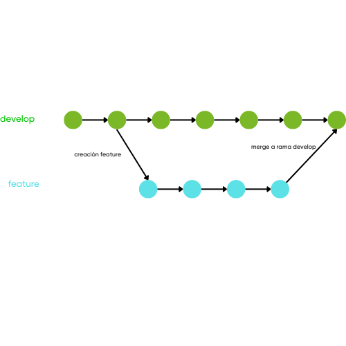

# Feature

## Ramas feature

Esta rama es utilizada para realizar nuevas características de tu proyecto, si bien es cierto no se sabe cuando se lanzará a  un ambiente productivo.

Estas características están planificadas dentro del desarrollo del proyecto.

Las ramas **feature** son creadas por lo general a partir de la rama **develop**, para tener la última versión de desarrollo, y una vez finalizada son fusionadas nuevamente a **develop** y eliminadas

### Representación rama feature

