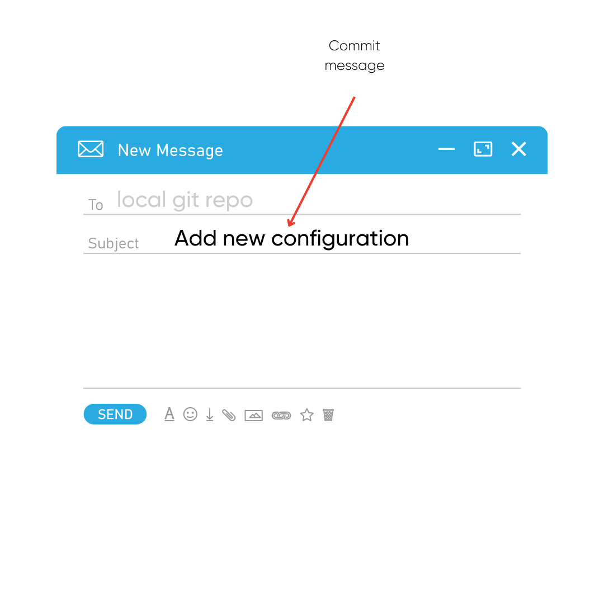
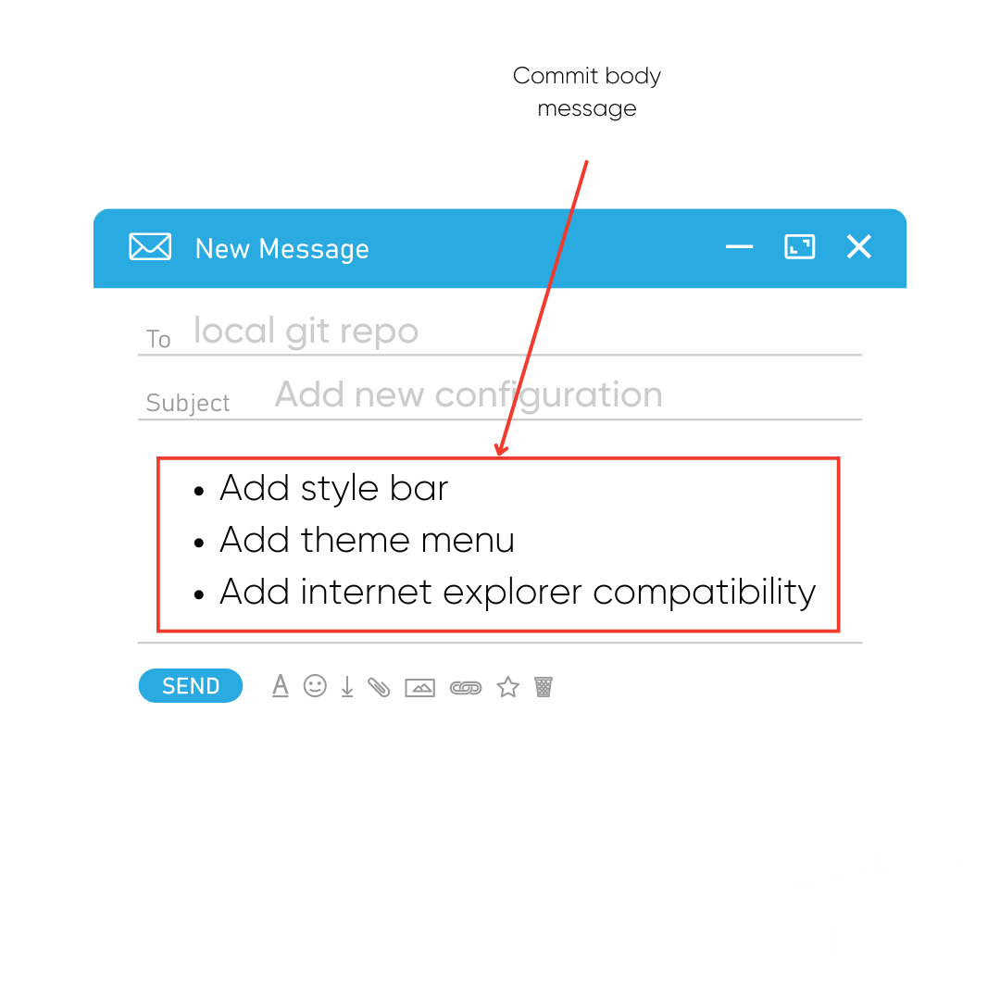

# Buenas Prácticas Git

## Commit

Es mejor hace commits pequeños, agrupando mejoras y características nuevas, que un solo commit grande

## Mensaja de commit

Usar verbos en inglés como **Add**,**Update**,**Change**,**Fix**,**Remove**,**Delete**

**Add:** Para cuando añades un archivo con funcionalidades nuevas
**Update/Change:** Para cuando actualizas o cambias el contenido de un archivo o funcionalidad
**Fix:** Para cuando se arregla un bug en el proyecto
**Remove/Delete:** Para cuando se quita o elimina algún archivo o una funcionilada del proyecto

## Buenas prácticas commits

## Mensajes de commit
NO usar puntuación, solo la coma

Trata un mensaje de commit como el eviar un correo electrónico, siendo así el primer mensaje el asunto del correo electrónico o un título

Si el primer mensaje del commit no es suficiente para explicar lo hecho, añade más contexto en el cuerpo el mensaje de commit
